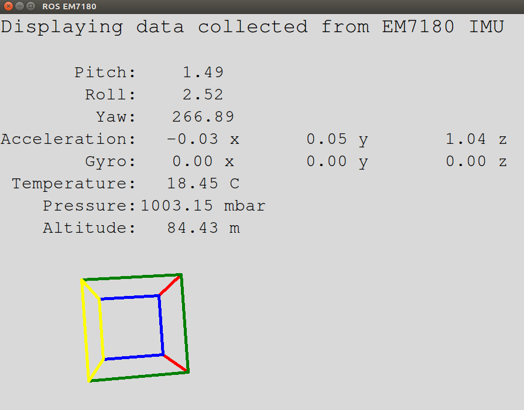

# em7180

A ROS IMU driver package for the Ultimate Sensor Fusion Solution (USFS) - LSM6DSM + LIS2MD and MPU9250.  Will work with other EM7180 Sensor Hub IMU's.  Tested on Raspberry Pi 3B with ROS Kinetic.

https://www.tindie.com/products/onehorse/ultimate-sensor-fusion-solution-lsm6dsm-lis2md/

### Calibration

You will need a Teensy 3.x or Arduino Mini Pro to calibrate your IMU.  The IMU will work as shipped, it will just take more measurements for the IMU sensor fusion algorithm to lock onto correct values.  By going through the calibration process the IMU will be able to 'warm start' and lock onto the correct values quicker.

https://github.com/gregtomasch/EM7180_SENtral_Calibration

### Wiring

    Connect the USFS - em7180 to your Raspberry Pi

        Hardware setup:
        EM7180 __________ RPi 3
        3V3 _____________ 1 (3.3V)
        SDA _____________ 3 (SDA)
        SCL _____________ 5 (SCL)
        GND _____________ 9 GND
        INT _____________ ???

### Installation

    Download an RPi image with ROS and Kinetic.
        Ubiquity Robotics: https://downloads.ubiquityrobotics.com/

    cd ~/catkin_ws/src
    git clone https://github.com/droter/em7180_imu/
    cd ~/catkin_ws
    catkin_make

### Usage

    Python SMbus is required.  If your system doesn't have it installed:
        pip install smbus

    Add the user to the I2C usergroup.
        adduser $USER i2c

    To run the driver:
        roslaunch em7180_imu imu_driver.launch
        
    To run the visualization:
        roslaunch em7180_imu imu_viz.launch
    

### Documentation

ROS standard for IMU data http://www.ros.org/reps/rep-0145.html

Published Topics:

    imu/data  (sensor_msgs/Imu)
    imu/data_raw  (sensor_msgs/Imu) No orientation 
    imu/mag  (sensor_msgs/MagneticField)
    sensor/temp  (sensor_msgs/Temperature)
    sensor/pressure  (sensor_msgs/FluidPressure)
    sensor/alt  (sensor_msgs/Float64)

### Angles

ROS standard for Coordinate Conventions http://www.ros.org/reps/rep-0103.html

    The imu/data is prepared to be fused with Robot_Localization
        Yaw is positive when rotated counter clockwise.
        Pitch is positive when nose is down.
        Roll is positive when left side is up.
        
        Yaw is zero when pointing East

### Mounting the imu on your robot

    Accelleration when electronic components are up is z = 1.
    Accelleration when nose is down 90 degrees is x = 1.
    Accelleration when left side is up 90 degrees is y = 1.

### Credits
    The package uses some python scripts provided by simondlevy's [repository](https://github.com/simondlevy/EM7180)
    The package uses some python scripts provided by vortexntnu's [repository](https://github.com/vortexntnu/em7180)

